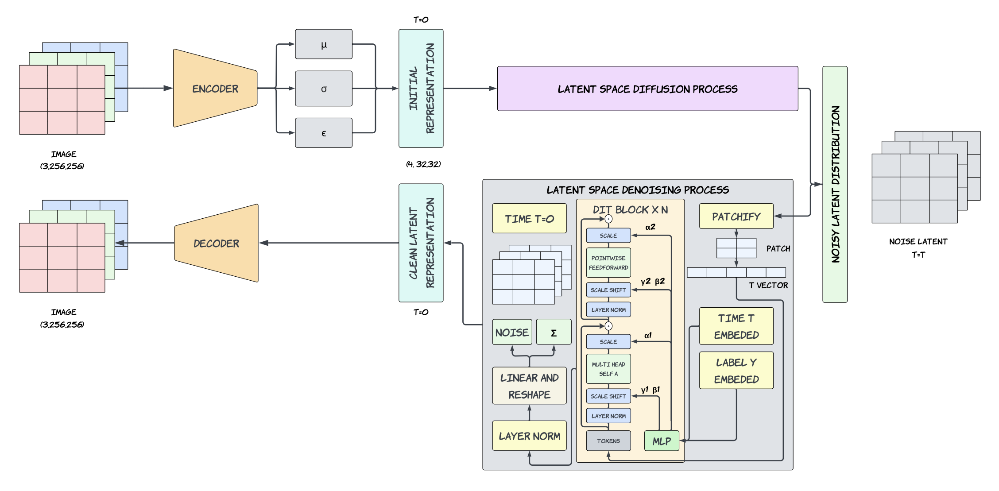

# Latent Diffusion Transformer

This project implements a Latent Diffusion Transformer (DiT) model for image generation and manipulation tasks. The architecture is inspired by the research paper "Scalable Diffusion Transformer" ([arXiv:2212.09748](https://arxiv.org/pdf/2212.09748)).

## Project Overview

This project explores a more efficient approach to training diffusion models by replacing the commonly used U-Net backbone with a transformer-based architecture, inspired by the "Scalable Diffusion Models with Transformers (DiT)" paper. Instead of working directly with high-dimensional pixel data, the model operates in a latent space, significantly reducing computational load.

While the original DiT paper presents a large-scale, highly optimized version using TPU clusters and multiple architectural variations (like adaptive layer norm and classifier-free guidance), this implementation is a simplified, PyTorch-based version focused on the core idea: using a Vision Transformer-style model to denoise latent representations.

The main advantage of this model is that it's lightweight, modular, and GPU-friendly, making it easier to train and extend. It offers a practical starting point for experimenting with diffusion transformers without the need for extensive computational resources.

## Project Structure

- `model_structure.py`: Contains the implementation of the DiT model, including the Transformer blocks and utility functions for patch extraction and reconstruction.
- `generate_dataset.py`: Script to preprocess images into latent representations using a Variational Autoencoder (VAE).
- `train_model.py`: Script to train the DiT model on precomputed latent representations.
- `requirements.txt`: Lists the dependencies required to run the project.
- `training_log.csv`: Logs training metrics such as loss per epoch.

## Methodology

### Data Preparation

- Images are converted into smaller "latent" representations using a pretrained Variational Autoencoder (VAE) encoder.
- These compressed representations are saved as `.npy` files and loaded using a custom dataset loader optimized for speed.

### Breaking Latents into Patches

- Each latent image is split into smaller blocks (patches) using PyTorch's unfold operation.
- These patches are flattened and used as input tokens for the transformer.

### Model Overview (DiT)

- **Time Embedding**: Each noise level (timestep) is embedded and used to guide the model.
- **Input Embedding**: Patches are converted into a form the transformer understands, with positional encoding added to retain spatial information.
- **Transformer Layers**: The model uses 10 layers with multi-head self-attention.
- **Output Projection**: The output is projected back to patch format and reshaped to the original latent layout.

### Adding Noise (Diffusion Step)

- A cosine schedule determines the amount of noise added at each step.
- A random timestep is chosen, and the latent is mixed with random noise to simulate the noising process.

### Training the Model

- The model learns to remove noise and recover the original latent using L1 loss (mean absolute error).
- Training is done using mixed precision and the FusedAdam optimizer.
- Progress is logged using Weights & Biases (wandb), and the best-performing models are saved automatically.

### Key Settings

- **Batch size**: 200
- **Learning rate**: 2e-5
- **Training epochs**: 1200
- **Transformer**: 10 layers, 8 attention heads, hidden size of 768, patch size 2
- **Diffusion steps**: 500

### Model Flow (Simplified)

1. Image → VAE Encoder → Latent (.npy file)
2. DataLoader → Patchify → Embed + Add Positional Encoding
3. Add Time Embedding → Transformer Layers → Output Projection
4. Unpatchify → Predicted Latent → Compare with True Latent (L1 Loss)

## Key Features

- **Latent Space Encoding**: Images are encoded into a compact latent space using a VAE.
- **Transformer-based Architecture**: The DiT model leverages Transformer blocks for efficient image generation.
- **Cosine Schedule**: Implements a cosine schedule for diffusion alphas.
- **WandB Integration**: Tracks training metrics and model performance using Weights & Biases.

## Architecture Diagram

Below is the architecture diagram of the Latent Diffusion Transformer model:



## Dataset

The dataset used for this project is the CelebA dataset. You can download it from Kaggle using the following link:

[https://www.kaggle.com/datasets/jessicali9530/celeba-dataset](https://www.kaggle.com/datasets/jessicali9530/celeba-dataset)

After downloading, place the dataset in the `dataset/` directory.

## Usage

### 1. Preprocess Dataset

Run the `generate_dataset.py` script to preprocess images into latent representations:

```bash
python generate_dataset.py
```

### 2. Train the Model

Train the DiT model using the `train_model.py` script:

```bash
python train_model.py
```

### 3. Configuration

Modify the `CONFIG` dictionary in `train_model.py` to customize training parameters such as batch size, learning rate, and number of epochs.

## Experiments and Results

The model was evaluated using Fréchet Inception Distance (FID), which measures how close generated outputs are to real images. Lower scores indicate better quality.

- **FID Score**: 1.5908 — a strong result that reflects the strength of this approach.

This performance is achieved by working in latent space, not full images. By compressing images into [4, 32, 32] latent vectors with a VAE and using self-attention over patches, the model efficiently learns global patterns. Time embeddings help the model adapt to different noise levels during training, enabling accurate denoising.

## Dependencies

Install the required dependencies using:

```bash
pip install -r requirements.txt
```

## Reference

- "Scalable Diffusion Models with Transformers" ([arXiv:2212.09748](https://arxiv.org/pdf/2212.09748))
- CelebA Dataset ([Kaggle](https://www.kaggle.com/datasets/jessicali9530/celeba-dataset))

## Acknowledgments

This project is based on the concepts and methodologies introduced in the referenced research paper.
